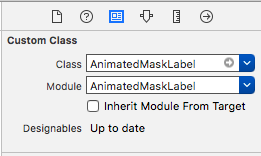
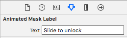

# Animated Mask Label


[](https://travis-ci.org/imjog/AnimatedMaskLabel)
[](http://cocoapods.org/pods/AnimatedMaskLabel)
[](http://cocoapods.org/pods/AnimatedMaskLabel)
[](http://cocoapods.org/pods/AnimatedMaskLabel)
[](https://gitter.im/AnimatedMaskLabel/Lobby?utm_source=badge&utm_medium=badge&utm_campaign=pr-badge&utm_content=badge)


<table>
  <tr>
    <td>Demo Screen</td>
    <td>Screenshot</td>
  </tr>
  <tr>
    <td></td>
    <td></td>
  </tr>
 </table>

## Demo/Example
For demo:
```
$ pod try AnimatedMaskLabel
```

To run the example project, clone the repo, and run `pod install` from the Example directory first.
```
$ cd Example
```
```
$ pod install
```
If you don't have CocoaPods installed, grab it with `[sudo] gem install cocoapods`.
```
$ open AnimatedMaskLabel.xcworkspace
```

## Requirements
- iOS 10.0 or later
- Swift 4+
- Xcode 9+

## Installation

#### CocoaPods

AnimatedMaskLabel is available through [CocoaPods](http://cocoapods.org). To install
it, simply add the following line to your Podfile:

```ruby
pod 'AnimatedMaskLabel'
```
#### Carthage

[Carthage](https://github.com/Carthage/Carthage) is a decentralized dependency manager that builds your dependencies and provides you with binary frameworks.

You can install Carthage with [Homebrew](http://brew.sh/) using the following command:

```bash
$ brew update
$ brew install carthage
```

To integrate Alamofire into your Xcode project using Carthage, specify it in your `Cartfile`:

```ogdl
github "imjog/AnimatedMaskLabel"
```

Run `carthage update` to build the framework and drag the built `AnimatedMaskLabel.framework` into your Xcode project.

#### Manual Installation
Just drag the `AnimatedMaskLabel.swift` files into your project.

## Usage
#### Step 1:
Set your view class as `AnimatedMaskLabel` - <br>


#### Step 2:
The text you want to animated:<br>


## Author

<table>
<tr>
<td>
     
     
     Jogendra Singh

<p align="center">
<a href = "https://github.com/imjog"></a>
<a href = "https://twitter.com/imjog24"></a>
<a href = "https://www.linkedin.com/in/jogendrasingh24/"></a>
</p>
</td>
</tr> 
  </table>

## License

AnimatedMaskLabel is available under the MIT license. See the [LICENSE](LICENSE) file for more info.
